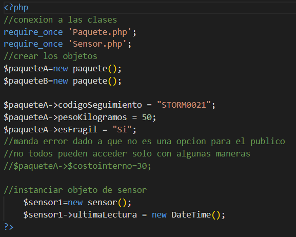
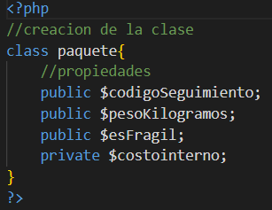
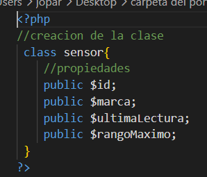

# Proyecto 01: Examen contra reloj

## 1. Nombre del proyecto
**Examen contra reloj**

## 2. Objetivo del proyecto
El objetivo de este proyecto es comprender e implementar los fundamentos iniciales de la Programación Orientada a Objetos (POO) mediante la abstracción del mundo real para la creación de clases, la definición de propiedades con modificadores de acceso básicos y la correcta instanciación de objetos en el lenguaje PHP.

## 3. Problema que resuelve
En sistemas de monitoreo y logística, la gestión desorganizada de datos dispersos provoca errores de consistencia. Este proyecto resuelve la necesidad de centralizar y modelar de forma estructurada las características individuales de los componentes de hardware (como sensores de medición) y de los elementos de carga (como paquetes de envío), asegurando una plantilla limpia para la manipulación independiente de cada registro.

## 4. Tecnologías utilizadas
- **Lenguaje:** PHP 8.x
- **Entorno / Servidor Local:** XAMPP (Apache)
- **Herramientas de Control:** Git y GitHub

## 5. Conceptos aplicados (según temario)
### Clases y Objetos
Creación de las estructuras de software `Paquete` y `Sensor` para representar entidades físicas.

### Propiedades / Atributos
Definición de características de las entidades como:
- `$codigoSeguimiento`
- `$pesoKilogramos`
- `$id`
- `$marca`

### Modificadores de Acceso (Visibilidad)
Uso de propiedades `public` para acceso general y propiedades `private` (como `$costoInterno` en la clase Paquete) para restringir el acceso directo fuera del entorno de la clase.

### Instanciación
Uso de la palabra reservada `new` para crear múltiples instancias independientes (`$paqueteA`, `$paqueteB`, `$sensor1`) en memoria.

### Composición de Clases
Uso de objetos nativos del sistema (como `new DateTime()`) asignados directamente a atributos de nuestras clases de control (`$ultimaLectura`).

## 6. Capturas de pantalla
A continuación se muestran las evidencias de la estructura y desarrollo del código guardadas en la carpeta de capturas:
* **Código del archivo principal:** ``
* **Estructura de la entidad de carga:** ``
* **Estructura de la entidad de medición:** ``
### Formulario de entrada / Vista general de la aplicación


### Implementación técnica de la entidad de carga


### Estructura de la entidad de medición


## 7. Instrucciones de ejecución

1. Asegúrate de tener instalado **XAMPP** en tu sistema.
2. Copia la carpeta completa de este proyecto (`Proyecto_01_Examen_contra_reloj`) dentro del directorio de despliegue del servidor local, comúnmente ubicado en:
   ```
   C:/xampp/htdocs/
   ```
3. Inicia el servicio **Apache** desde el Panel de Control de XAMPP.
4. Abre tu navegador web preferido.
5. Ingresa la siguiente dirección en la barra de direcciones:

   ```
   http://localhost/Proyecto_01_Proyecto_01_Examen_contra_reloj/codigo/index.php
   ```

## 8. Reflexión

Con este proyecto aprendí de manera más práctica cómo funcionan los objetos y las clases dentro de la Programación Orientada a Objetos. Lo que encontré más complicado fue la representación visual de las relaciones y elementos del diagrama, especialmente el uso de flechas y la organización de los componentes.

Si tuviera que mejorar el proyecto, trabajaría en una estructura más ordenada del código y agregaría una página principal (`index`) más completa para facilitar la navegación y presentación de la aplicación.