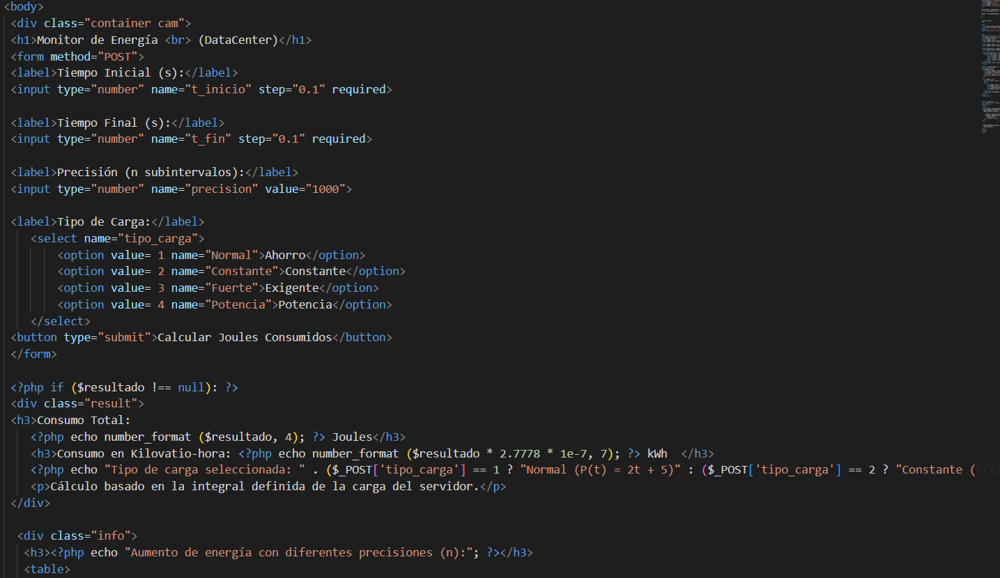
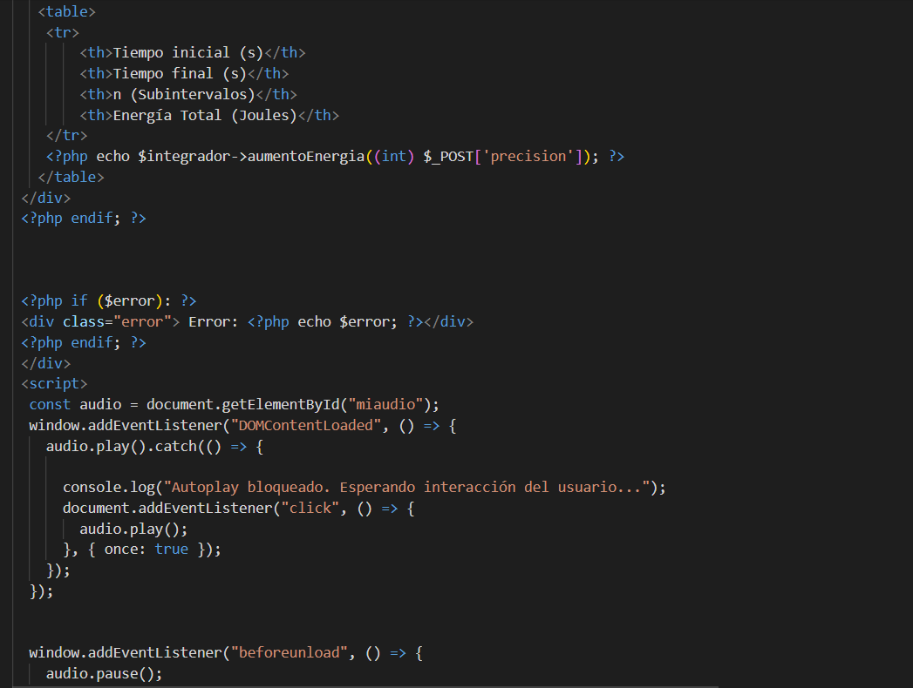
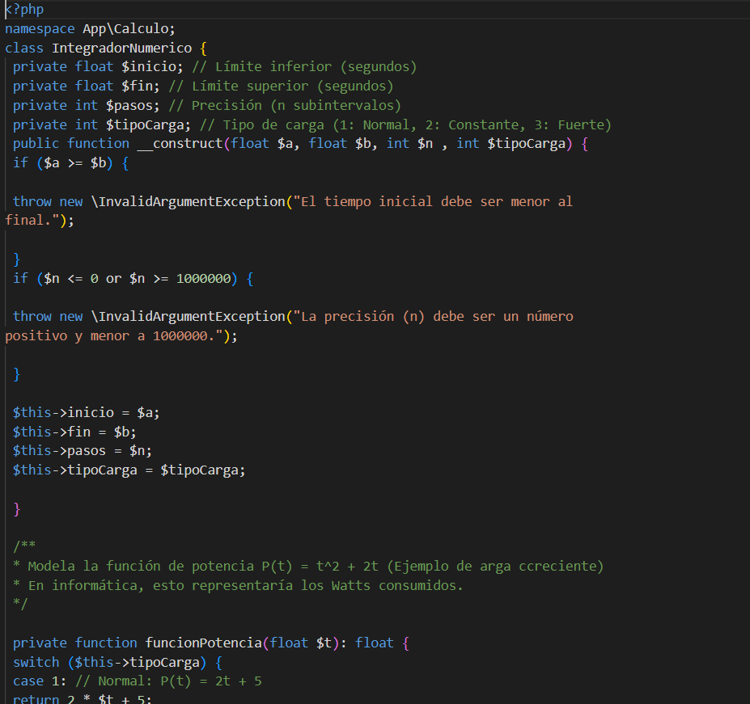
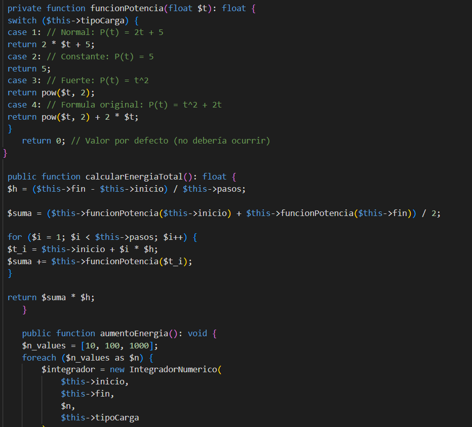
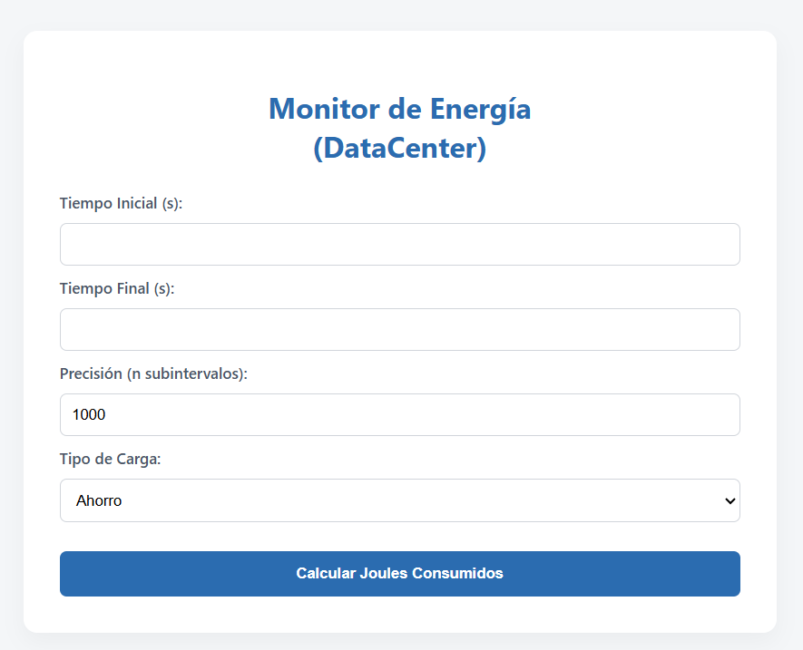
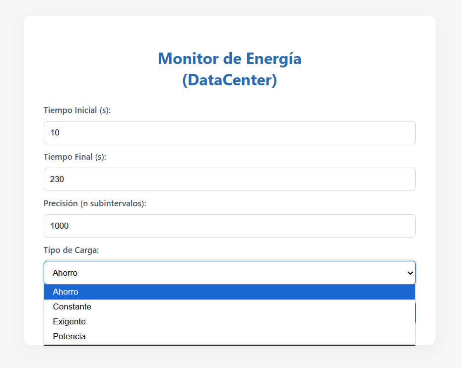
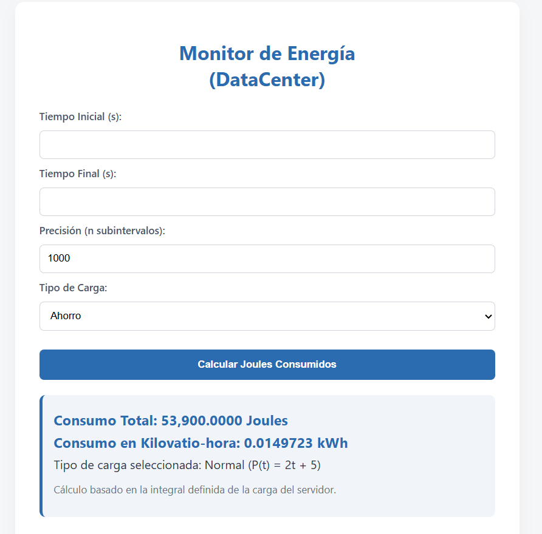

# Proyecto 02: Consumo Energético de Servidores 

## 1. Nombre del proyecto
**Consumo Energético de Servidores**

## 2. Objetivo del proyecto
El objetivo de este proyecto es aplicar el concepto de métodos avanzados y paso de parámetros en la Programación Orientada a Objetos para modelar de forma matemática, calcular y optimizar el consumo de energía eléctrica (en Joules y kWh) de diferentes infraestructuras de servidores en un centro de datos mediante el método de integración numérica.

## 3. Problema que resuelve
Los centros de datos modernos necesitan controlar con precisión su consumo energético para evitar sobrecostos y administrar la carga de trabajo en la nube. Este proyecto resuelve la necesidad de automatizar el cálculo de la energía total consumida por un servidor cuando la potencia varía dinámicamente con el tiempo, procesando diferentes tipos de carga (Ahorro, Constante, Fuerte y Potencia) según las necesidades de simulación del usuario.

## 4. Tecnologías utilizadas
- **Lenguaje:** PHP 8.x
- **Tecnologías Web:** HTML5 y CSS3 personalizado (`style.css`)
- **Entorno / Servidor Local:** XAMPP (Apache)
- **Control de Versiones:** Git y GitHub

## 5. Conceptos aplicados (según temario)

### Abstracción y Encapsulamiento
Organización del código utilizando Namespaces bajo el estándar PSR-4 (`codigo\src\IntegradorNumerico`).

### Instanciación con Parámetros
Creación del objeto:

```php
$integrador = new IntegradorNumerico(...);
```

pasando variables dinámicas capturadas desde el formulario (`t_inicio`, `t_fin`, `precision`, `tipo_carga`).

### Métodos de Clase
Implementación de funciones especializadas en la lógica del negocio como:

- `calcularEnergiaTotal()`
- `aumentoEnergia()`

### Estructuras de Control Avanzadas
Uso de ciclos dinámicos para calcular la aproximación por subintervalos (`n`) y el uso de bloques `try-catch` para el manejo seguro de excepciones y errores en tiempo de ejecución.

## 6. Capturas de pantalla

### Pantallas de la aplicación
- 
- 
- 

### Código fuente
- 
- 

### Evidencias de funcionamiento
- 
- 
- 

## 7. Instrucciones de ejecución

1. Asegúrate de que el panel de control de **XAMPP** esté instalado en tu equipo.
2. Descarga o copia la carpeta del proyecto dentro de la siguiente ruta:

   ```
   C:/xampp/htdocs/
   ```

3. Activa el servidor web **Apache** desde el panel de control de XAMPP.
4. Abre tu navegador web preferido.
5. Ingresa la siguiente dirección URL:

   ```
   http://localhost/Proyecto_02_Consumo_Energetico_Servidores/codigo/index.php
   ```

## 8. Reflexión Personal

A través del desarrollo de este monitor energético, logré comprender de manera mucho más clara la utilidad de los métodos de clase para procesar fórmulas matemáticas complejas y estructurar de manera organizada las reglas de negocio del software.

Lo más complicado de esta práctica fue trabajar con los Namespaces en PHP y asegurar que las clases se comunicaran correctamente con el formulario principal (`index`) sin generar problemas de alcance o referencias incorrectas. Además, integrar y mantener la música funcionando continuamente durante la ejecución de la aplicación representó un reto importante, ya que evitar que se detuviera fue una de las partes más difíciles del proyecto.

Para futuras versiones del monitor, mejoraría la experiencia visual de la interfaz y agregaría una mayor variedad musical para hacer la aplicación más atractiva e interactiva para el usuario.