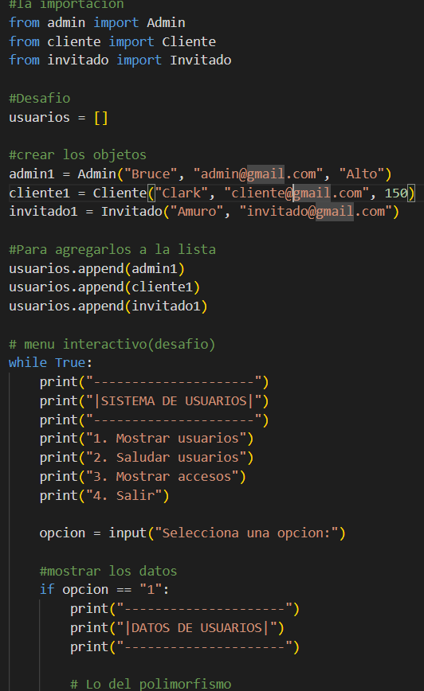
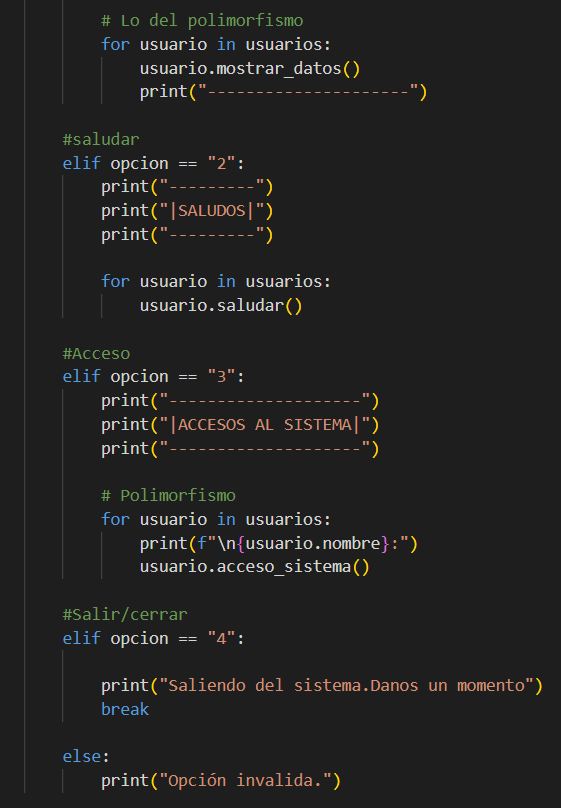
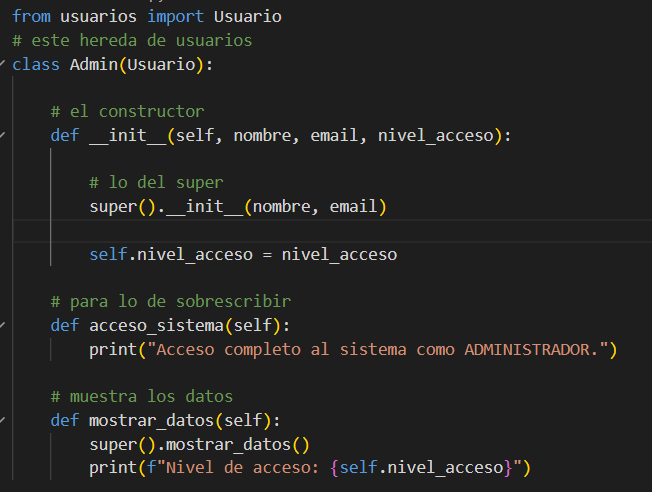
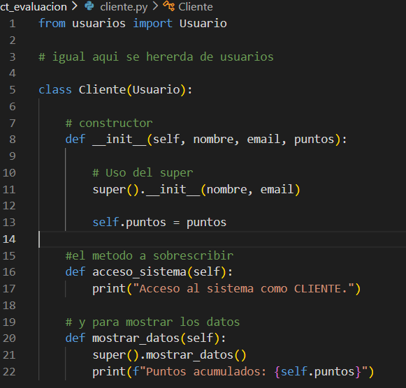
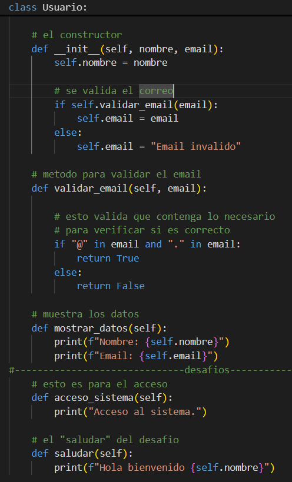
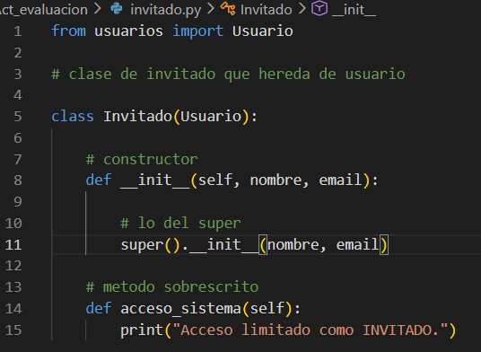
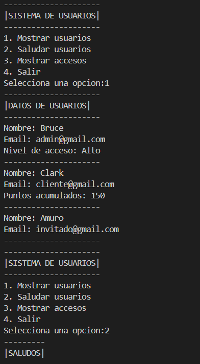
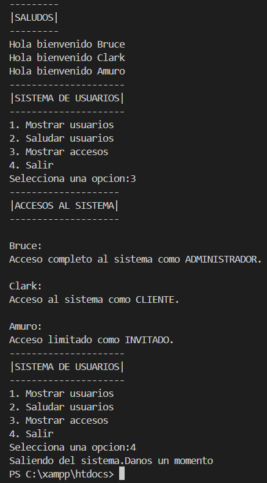

# Proyecto 03:Usuarios

## 1. Nombre del proyecto
**usuarios**

## 2. Objetivo del proyecto
El objetivo de este proyecto es implementar los conceptos avanzados de Herencia y Polimorfismo en la Programación Orientada a Objetos utilizando Python. Se busca modelar una estructura jerárquica de clases que comparta atributos comunes y sobrescriba métodos específicos para entregar respuestas personalizadas según el tipo de objeto instanciado.

## 3. Problema que resuelve
Las plataformas digitales modernas requieren gestionar diferentes tipos de cuentas de usuario con permisos y niveles de acceso totalmente distintos (como administradores, clientes o invitados). Este proyecto resuelve la duplicidad de código en el software al agrupar los datos generales en una clase base, permitiendo controlar de manera automatizada y masiva las acciones y restricciones de cada rol a través de una lista centralizada.

## 4. Tecnologías utilizadas
* **Lenguaje:** Python 3.x
* **Entorno de Desarrollo:** Visual Studio Code
* **Control de Versiones:** Git y GitHub

## 5. Conceptos aplicados (según temario)
* **Herencia Simple:** Las clases hijas `Admin`, `Cliente` e `Invitado` heredan las propiedades fundamentales de la clase base padre `Usuario`.
* **Uso de la función `super()`:** Empleada de manera correcta en los constructores (`__init__`) y métodos de las subclases para reutilizar la inicialización de atributos (`nombre`, `email`) y comportamientos del padre.
* **Polimorfismo (Sobrescritura de Métodos):** Redefinición del método `acceso_sistema()` y `mostrar_datos()` en cada clase hija para que actúen de formas completamente diferentes al ser invocados dentro de un ciclo interactivo.
* **Modularización:** División del código limpio en archivos independientes (`usuarios.py`, `admin.py`, `cliente.py`, `invitado.py`) conectados a un controlador principal.
* **Validación de Datos Básica:** Inclusión de lógica algorítmica para determinar si una cadena de texto cumple con la estructura requerida de un correo electrónico a través de la presencia de caracteres clave (`@` y `.`).

## 6. Capturas de pantalla

### Pantallas principales del sistema
- 
- 

### Implementación de los tipos de usuario
- 
- 
- 
- 

### Evidencias de funcionamiento
- 
- 

## 7. Instrucciones de ejecución
1. Asegúrate de tener instalado Python 3.x en tu sistema operativo.
2. Abre tu terminal de comandos (cmd, PowerShell o terminal integrada de VS Code).
3. Navega hasta la ubicación de la carpeta del proyecto donde se encuentra el archivo controlador:
   ```bash
   cd Proyecto_03_Usuarios/
   ```
4. Ejecuta el archivo principal:

   ```bash
   python main.py
   ```
## 8. Reflexión Personal

En este proyecto aprendí mejor cómo funciona la herencia entre objetos y la forma de utilizar las clases hijas a partir de una clase padre. También comprendí cómo llamar y utilizar estos objetos desde un archivo principal (`main`) para que trabajen juntos dentro de una misma aplicación.

Lo más difícil fue precisamente realizar las importaciones y llamadas de las clases desde el archivo principal, ya que al principio tenía problemas para que los módulos se reconocieran correctamente entre sí.

Si volviera a desarrollar este proyecto, mejoraría principalmente la estructura y organización del código para que fuera más clara y fácil de mantener, además de optimizar la forma en que implementé algunas clases y métodos.