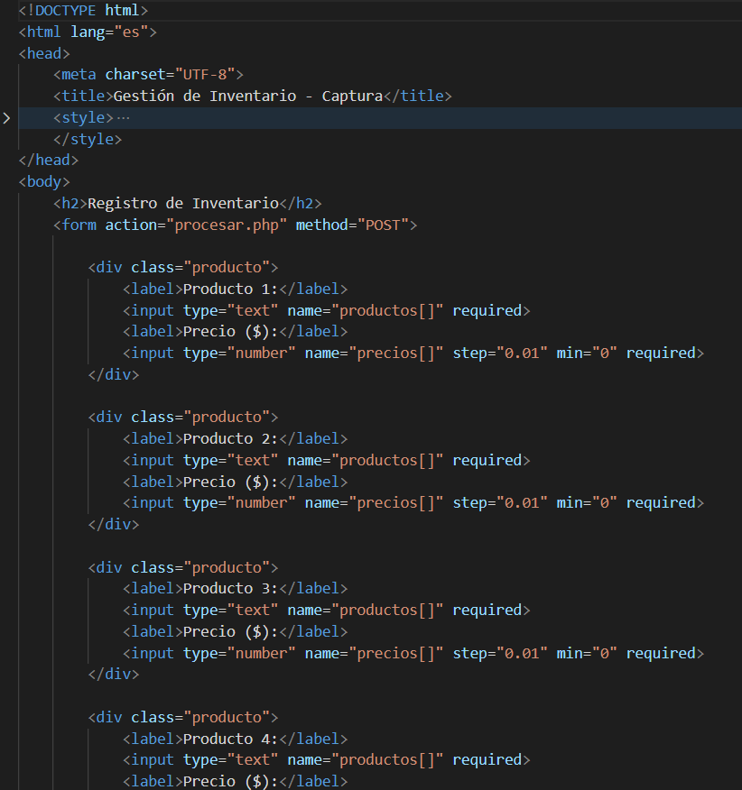
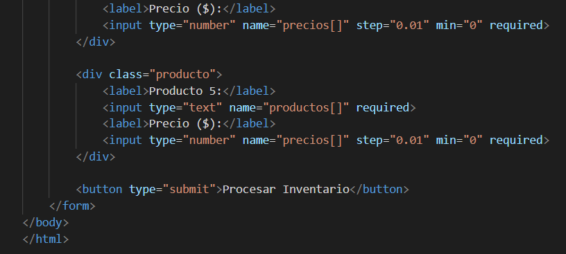
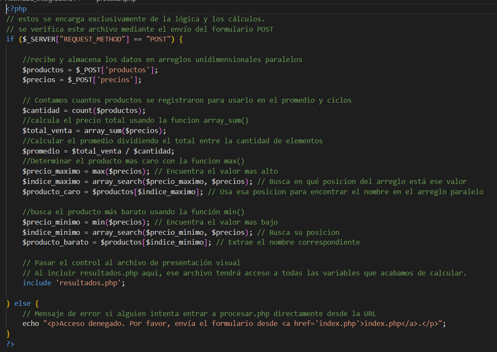
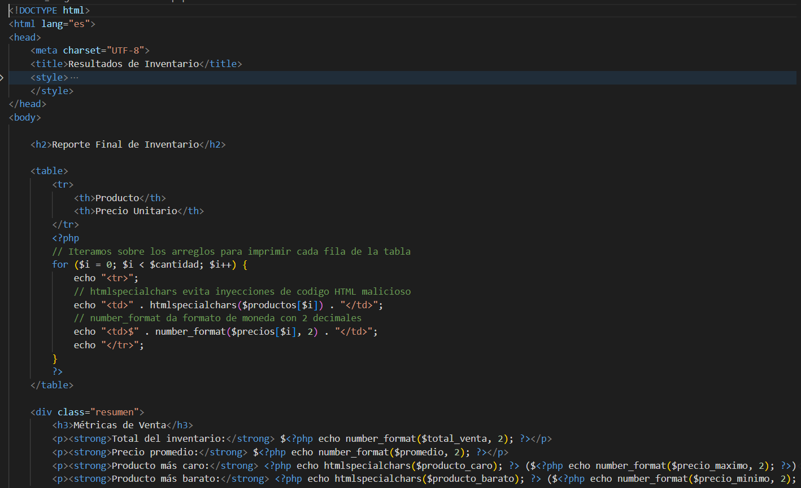
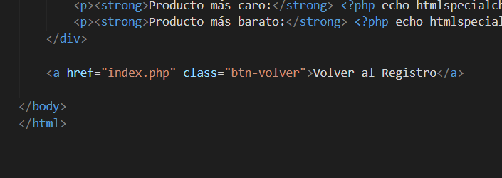
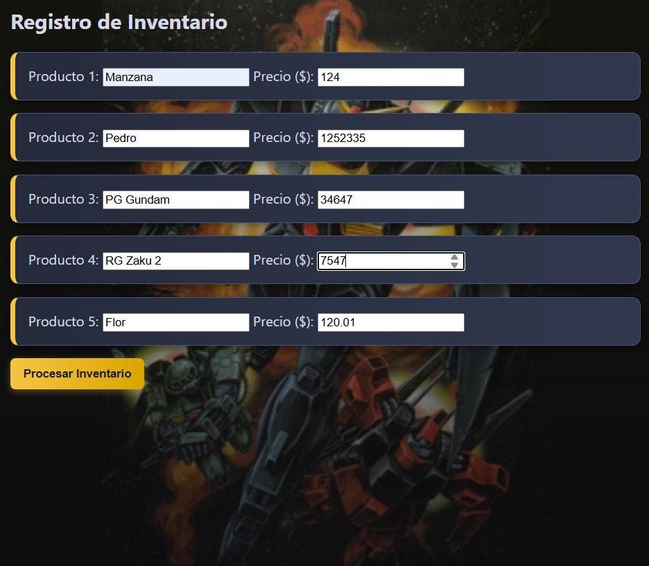
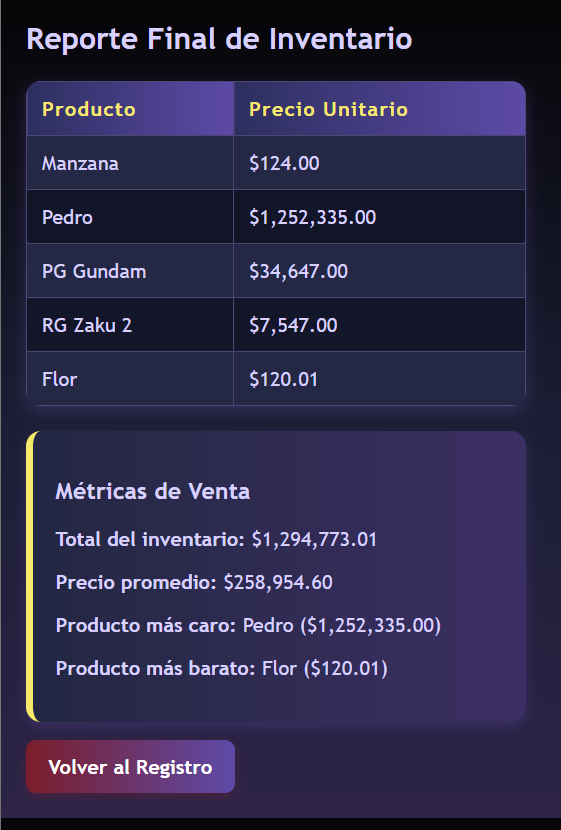

# Proyecto 04: Arreglos Unidimensionales

## 1. Nombre del proyecto
**Proyecto 04: Arreglos Unidimensionales**

## 2. Objetivo del proyecto
El objetivo de este proyecto es aplicar el uso de arreglos unidimensionales paralelos en PHP para capturar, almacenar, procesar y analizar información de un conjunto de productos de forma estructurada y eficiente, optimizando los cálculos matemáticos mediante funciones nativas del lenguaje.

## 3. Problema que resuelve
El dueño de una tienda en línea necesita un módulo ligero para gestionar el inventario de sus productos. Este proyecto resuelve la necesidad de automatizar la captura de nombres y precios de los productos disponibles, calcular de forma instantánea el valor total del inventario, el precio promedio, y determinar con precisión matemática cuál es el producto más caro y cuál es el más barato sin realizar recorridos manuales redundantes.

## 4. Tecnologías utilizadas
- **Lenguaje:** PHP 8.x
- **Tecnologías Web Front-End:** HTML5 y CSS3 integrado con un diseño adaptado (estilo e imagen de fondo `gmk2.png` personalizados)
- **Entorno / Servidor Local:** XAMPP (Apache)
- **Control de Versiones:** Git y GitHub

## 5. Conceptos aplicados (según temario)

### Arreglos Unidimensionales Paralelos
Uso de `$productos[]` y `$precios[]` de forma emparejada a través de sus índices para mantener la relación lógica entre el nombre del artículo y su costo.

### Funciones Nativas de Arreglos
Implementación de:
- `array_sum()` para la adición masiva.
- `max()` y `min()` para encontrar extremos numéricos.
- `count()` para determinar la longitud dinámica de la colección de datos.

### Mapeo e Indexación
Empleo de la función `array_search()` para localizar la clave o índice exacto del valor máximo y mínimo, permitiendo extraer el nombre correcto del producto asociado.

### Separación de Capas (Modularización)
División limpia del código donde:
- `index.php` actúa como vista de captura.
- `procesar.php` resuelve la lógica algorítmica.
- `resultados.php` muestra la información final utilizando `htmlspecialchars()` para un manejo seguro de los datos.

## 6. Capturas de pantalla

### Formularios de captura
- 
- 

### Procesamiento de datos
- 

### Resultados obtenidos
- 
- 

### Evidencias de funcionamiento
- 
- 

## 7. Instrucciones de ejecución

1. Asegúrate de iniciar los servicios de **Apache** desde tu panel de control de XAMPP.
2. Mueve la carpeta de este proyecto a la ruta del servidor local:

   ```text
   C:/xampp/htdocs/
   ```

3. Abre tu navegador web habitual.
4. Digita la siguiente URL para cargar el formulario inicial:

   ```text
   http://localhost/Proyecto_04_Arreglos_Unidimensionales/codigo/index.php
   ```

5. Rellena los campos con los nombres y precios de los 5 productos solicitados.
6. Haz clic en el botón de enviar.
7. El sistema procesará automáticamente la información y te redirigirá al reporte final donde se mostrarán las métricas calculadas del inventario.

## 8. Reflexión personal

Antes de esta actividad sabía que los arreglos servían para guardar datos en programación, pero no conocía todas las funciones que podían facilitar el trabajo. Aprendí a recorrer arreglos, obtener valores máximos y mínimos, sumar elementos y manipular información de forma más ordenada y eficiente.

También comprendí la importancia de que los arreglos tengan la misma cantidad de elementos para evitar errores y mantener la relación correcta entre los datos almacenados. Con lo que aprendí, podría crear programas más organizados para manejar listas de productos, calificaciones, inventarios o cualquier otro conjunto de datos.

Además, ahora puedo desarrollar códigos más cortos, claros y fáciles de mantener aprovechando las funciones integradas que ofrece PHP para trabajar con arreglos.