# Proyecto 05: Gestión de Bitácoras

## 1. Nombre del proyecto
**Gestión de Bitácoras**

## 2. Objetivo del proyecto
El objetivo de este proyecto es implementar mecanismos de persistencia de datos del lado del servidor utilizando el sistema de archivos nativo de PHP. Se busca capturar información estructurada desde un formulario web para almacenarla y recuperarla dinámicamente desde un archivo de texto plano (`.txt`), garantizando la integridad de los datos sin el uso de bases de datos relacionales.

## 3. Problema que resuelve
Una empresa de seguridad lleva un registro manual en papel de las actividades diarias de su equipo, lo que provoca pérdida de información y lentitud en las auditorías. Este proyecto resuelve la necesidad de digitalizar mediante un formato ligero y rápido el control de revisiones, incidentes y tareas completadas, permitiendo que múltiples registros queden guardados cronológicamente y listos para ser leídos de forma visual en la interfaz del sistema.

## 4. Tecnologías utilizadas
* **Lenguaje:** PHP 8.x
* **Tecnologías Web:** HTML5 y CSS3 con diseño responsivo e interfaz optimizada
* **Manejo de Datos:** Archivos de texto plano (`bitacora.txt`)
* **Entorno / Servidor Local:** XAMPP (Apache)
* **Control de Versiones:** Git y GitHub

## 5. Conceptos aplicados (según temario)
* **Persistencia en Archivos:** Uso de la función `file_put_contents()` para guardar de manera permanente las cadenas de texto construidas con los datos de los formularios.
* **Banderas de Control de Flujo:** Uso de constantes nativas como `FILE_APPEND` para añadir contenido al final del documento sin borrar el historial previo, y `LOCK_EX` para evitar colisiones de escritura simultánea por parte de múltiples usuarios.
* **Sanitización y Seguridad:** Implementación de `htmlspecialchars()` con la configuración `ENT_QUOTES` para mitigar vulnerabilidades de inyección de código malicioso (XSS) antes de guardar o renderizar las variables.
* **Procesamiento de Cadenas mediante Expresiones Regulares:** Empleo de la función `preg_match()` para desglosar de forma automatizada cada bloque de texto plano basado en patrones (`Fecha:`, `Actividad:`, `Responsable:`) y transformarlos en variables ordenadas para la vista.

## 6. Capturas de pantalla

### Interfaces principales del sistema
- 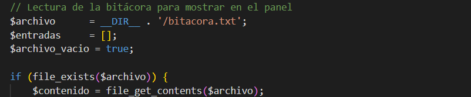
- 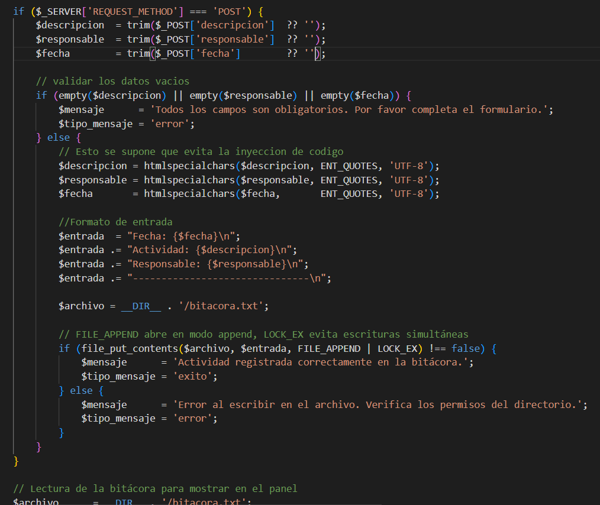
- 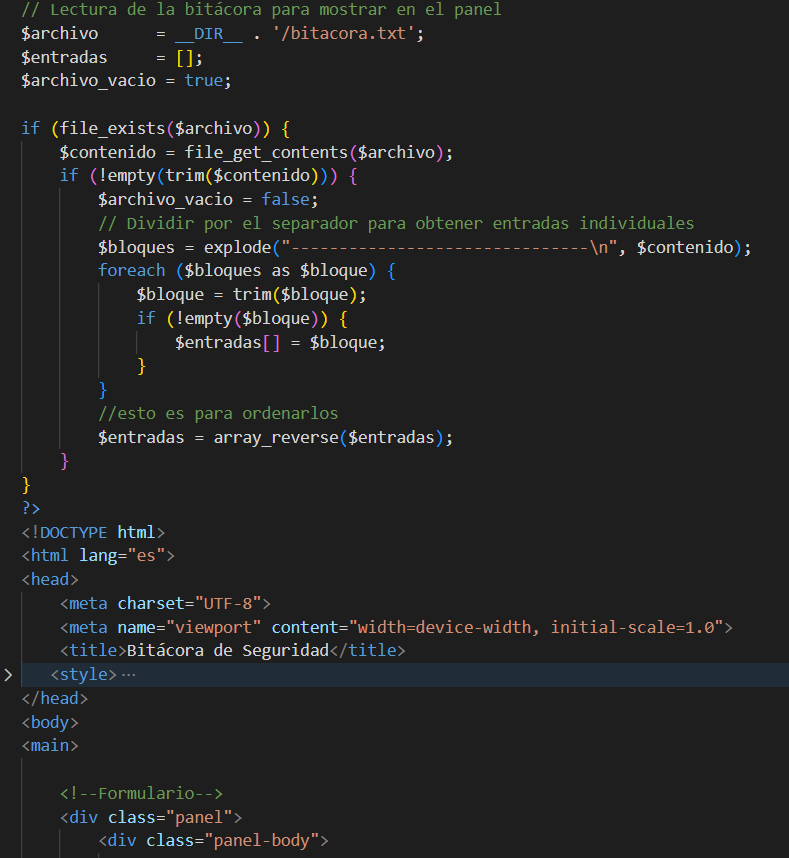
- 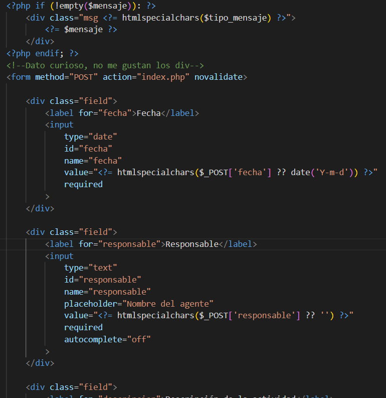
- 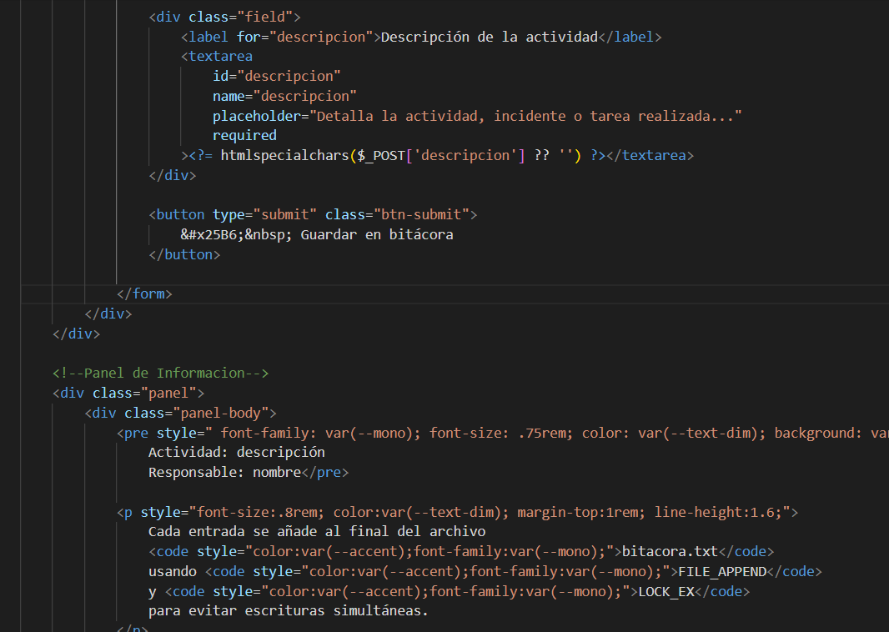
- 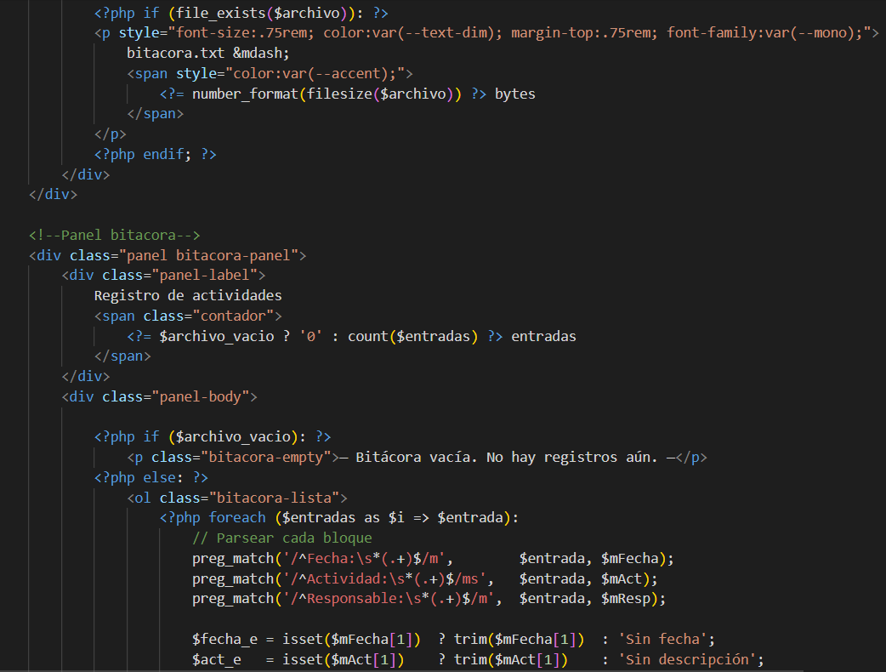
- 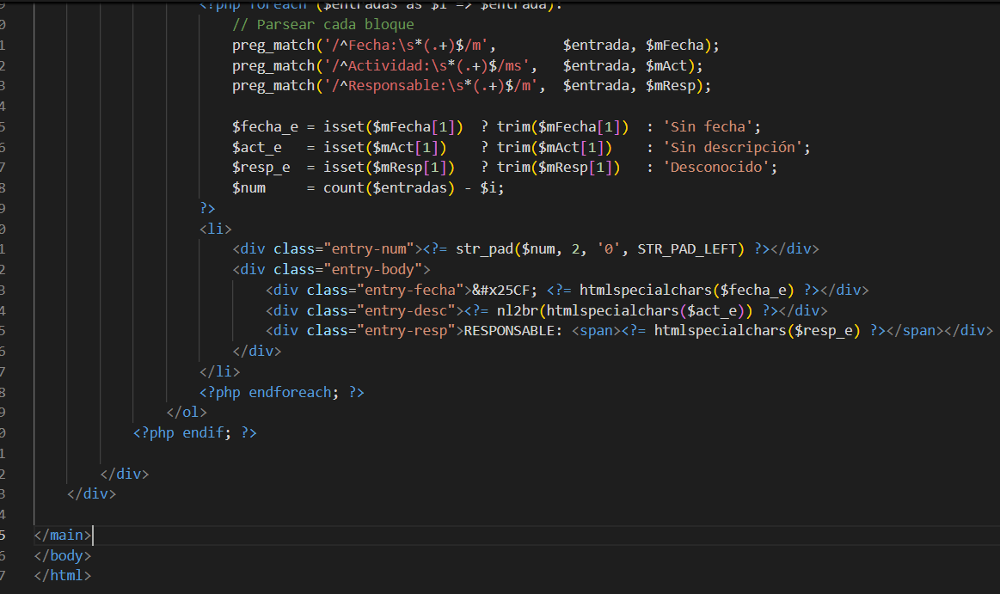

### Evidencias de funcionamiento
- 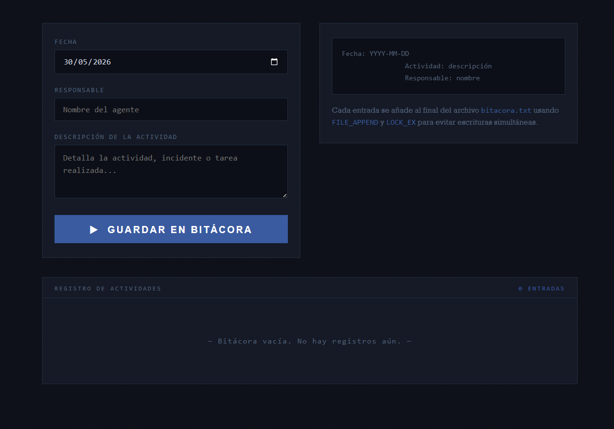
- 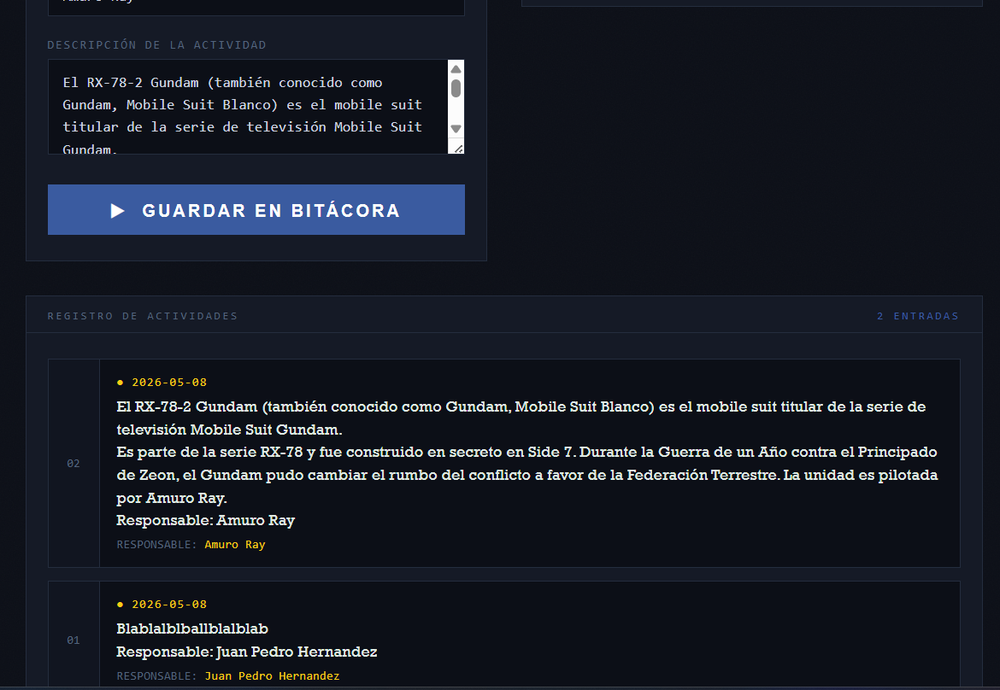
- 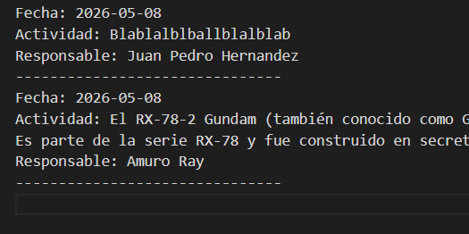
- 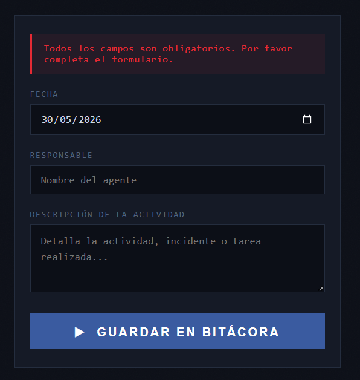

## 7. Instrucciones de ejecución

1. Inicia los servicios de **Apache** dentro del Panel de Control de XAMPP.
2. Copia la carpeta de este proyecto dentro del directorio raíz local:

   ```text
   C:/xampp/htdocs/
   ```

3. Abre el navegador web de tu preferencia.
4. Digita la siguiente dirección URL para acceder a la aplicación:

   ```text
   http://localhost/Proyecto_05_Gestion_Bitacoras/codigo/index.php
   ```

5. Rellena los datos solicitados (Fecha, Actividad y Responsable).
6. Presiona el botón de registro para añadir una nueva entrada.
7. El sistema guardará la información en el archivo de texto y mostrará el historial actualizado en tiempo real dentro de la aplicación.
## 8. Reflexión personal

Ya tenía conocimientos sobre el uso de archivos `.txt` para almacenar información y también sobre el manejo de sesiones en PHP. Para esta actividad tuve que apoyarme en algunos códigos que había realizado anteriormente durante mi etapa en el CBTis y complementar algunas partes con ayuda de herramientas de inteligencia artificial.

Con este proyecto reforcé el uso de sesiones y aprendí nuevamente a trabajar con archivos de texto para guardar y recuperar información de manera organizada. También practiqué el manejo de código dentro de la aplicación para procesar y mostrar los registros almacenados.

Una posible aplicación práctica sería utilizar este sistema como una agenda o lista de pendientes personales. Si en el futuro agregara funciones para editar o eliminar registros, podría convertirse en una herramienta más completa para la administración de actividades.

Durante el desarrollo me compliqué más de lo necesario, ya que intenté implementar soluciones más complejas de las que requería el proyecto. Esto me ayudó a comprender la importancia de planificar mejor la estructura antes de comenzar a programar.